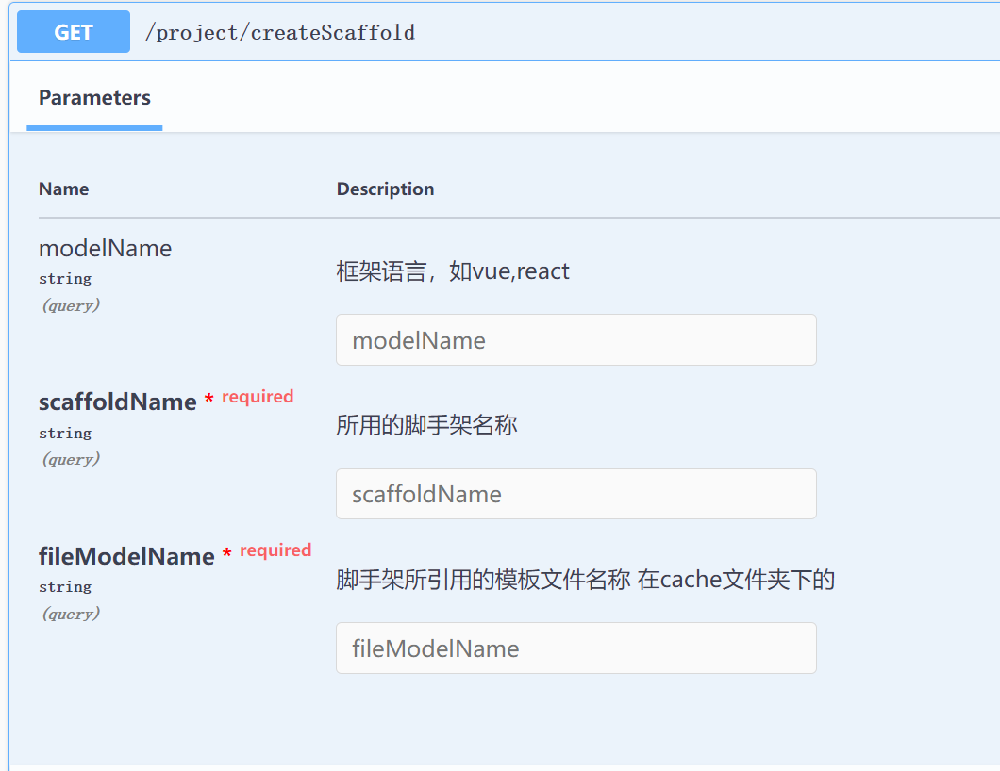

## Description

webide的后端项目，数据库用的是mongo，数据库配置在ormconfig.json


## Installation

```bash
$ npm install
```

## Running the app

```bash
# development
$ npm run start

# watch mode
$ npm run start:dev

# production mode
$ npm run start:prod
```

## 配置
跑起项目，会创建出project和cache文件
- 在cache文件放入你的项目文件，如create-react-app的模板文件。
那么就在cache里面去创建
- 需要注意的就是，你的模板文件中要么有个config.js，对应配置上port端口，或者在package.json配置PORT
如在create-react-app的package.json配置，也就是加上cross-env PORT=5000，记得npm包得安装下cross-env
- 这里为了统一命令，将原本的start改成了dev，后续服务去帮你开启这个，就是通过yarn dev
```
{
    "dev": "cross-env PORT=5000 react-scripts start",
    "build": "react-scripts build",
    "test": "react-scripts test",
    "eject": "react-scripts eject"
}
```
- 对应的在swagger上手动创建一下这个脚手架，录入下数据，地址http://localhost:4500/swagger/#/project%3A%E6%96%B0%E5%BB%BA%E9%A1%B9%E7%9B%AE/ProjectController_createScaffold
也就是/project/createScaffold
